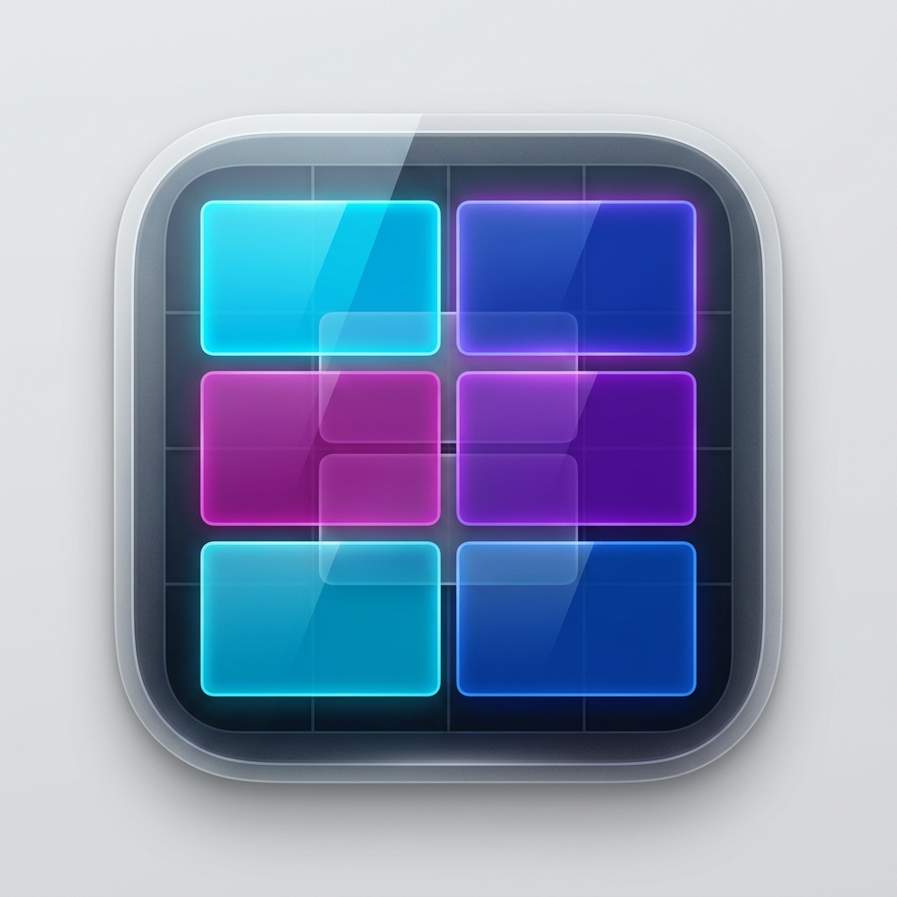

# WinMan ⊞

A native macOS super app combining **Easy-Move-Resize**, **Rectangle window snapping**, and **AltTab (Community & Pro Unlocked)** into a single unified utility.

<p align="center">
  
</p>

## Features

### 1. Alt-Tab Window Switcher (All Pro Features Unlocked)
Brings the beloved Windows-style window switcher to macOS with zero paywalls or limitations:
- **Trigger**: Hold `⌥ Option` and press `⇥ Tab` (`⌥⇥`) to display the live visual switcher HUD.
- **Navigation**:
  - Press `Tab` repeatedly to cycle forward.
  - Press `Shift + Tab` (`⇧⌥⇥`) to cycle backward.
  - Arrow keys (`←`, `→`, `↑`, `↓`) to navigate tiles.
- **Commit & Switch**: Release the `Option` key to instantly focus and bring the selected window to the front. Or hit `Return`. Press `Esc` to cancel.
- **Live Thumbnails**: High-resolution window previews captured in real time with application icons and title badges.
- **🔎 Live Search in Switcher**: Type letters while the switcher is visible to instantly filter open windows by application name or window title.
- **🔢 Direct 1–9 Jump Shortcuts**: Press keys `1` through `9` to jump directly to any indexed window.
- **⚡️ In-Switcher Window Actions**:
  - `W`: Close the selected window
  - `M`: Minimize the selected window
  - `F`: Toggle Fullscreen / Maximize
  - `Q`: Quit the target application

---

### 2. Easy-Move-Resize (Drag from Anywhere)
No need to carefully aim for the window's title bar:
- **Move**: Hold your selected modifier keys (Default: `⌘ + ⌃`, configurable to `⌥ + ⌘`, `⌃ + ⌥`, or custom) and **Left-Click & Drag** anywhere inside any window.
- **Resize**: Hold modifier keys and **Right-Click & Drag** anywhere inside any window to dynamically resize it from the nearest edge/corner.
- **Trackpad-friendly Resize**: Hold modifier keys + `⇧` (Shift) and **Left-Click & Drag** to resize.
- **Custom Modifiers**: Change modifiers on the fly from the Menu Bar submenu or open the **Preferences...** (`⌘,`) window!

---

### 3. Rectangle Hotkey Snapping & Management
Quickly snap and reposition windows with global keyboard shortcuts:

| Action | Shortcut (Ctrl+Opt) | Alternative (Cmd+Opt) |
| :--- | :--- | :--- |
| **Maximize** | `⌃⌥↵` (Ctrl + Opt + Enter) | `⌥⌘F` (Opt + Cmd + F) |
| **Restore Previous Size** | `⌃⌥⌫` (Ctrl + Opt + Backspace) | `⌥⌘R` (Opt + Cmd + R) |
| **Left Half** | `⌃⌥←` (Ctrl + Opt + Left Arrow) | |
| **Right Half** | `⌃⌥→` (Ctrl + Opt + Right Arrow) | |
| **Top Half** | `⌃⌥↑` (Ctrl + Opt + Up Arrow) | |
| **Bottom Half** | `⌃⌥↓` (Ctrl + Opt + Down Arrow) | |
| **Top Left Quarter** | `⌃⌥U` | |
| **Top Right Quarter** | `⌃⌥I` | |
| **Bottom Left Quarter** | `⌃⌥J` | |
| **Bottom Right Quarter** | `⌃⌥K` | |
| **Left Third** | `⌃⌥D` | |
| **Center Third** | `⌃⌥E` | |
| **Right Third** | `⌃⌥F` | |
| **Left Two Thirds** | `⌃⌥G` | |
| **Right Two Thirds** | `⌃⌥T` | |
| **Center Window** | `⌃⌥C` | |
| **Make Larger** | `⌃⌥+` | |
| **Make Smaller** | `⌃⌥-` | |
| **Next Display** | `⌃⌥⌘→` | |
| **Previous Display** | `⌃⌥⌘←` | |

---

### 4. Preferences & Menu Bar Integration
- **Menu Bar Icon**: Custom window-grid icon matching the app branding.
  - **Monochrome (macOS Tahoe)**: Clean grayscale template icon that dynamically adapts to macOS Light and Dark modes.
  - **Vibrant Color**: Full-color miniature icon.
  - Switch styles directly from the **Menu Bar Icon** submenu or within **Preferences (`⌘,`)**.
- **Preferences (`⌘,`)**:
  - Configure Easy-Move-Resize modifier keys.
  - Configure Alt-Tab window switcher (thumbnails, live search, 1-9 direct jump).
  - Select Menu Bar icon style.
- Fast modifier preset switcher (`⌘ + ⌃`, `⌥ + ⌘`, `⌃ + ⌥`).
- Toggle individual engines (Alt-Tab vs. Easy Move & Resize vs. Hotkeys).
- Execute any layout directly from the **Window Actions** menu.
- Quick access to the Shortcuts & Gestures reference cheat sheet.

---

## Getting Started

### Building

```bash
# Build the WinMan.app bundle:
make app

# Or run directly from terminal:
swift run
```

### Installation (Optional)

To install to your `/Applications` directory:
```bash
make install
```

### Accessibility Permissions

Window managers on macOS require Accessibility permissions to resize windows, switch windows, and listen to global mouse/keyboard shortcuts:

1. When you first launch `WinMan`, macOS will prompt you to grant Accessibility access.
2. If prompted, click **Open System Settings** (or navigate to **System Settings -> Privacy & Security -> Accessibility**).
3. Toggle the switch next to **WinMan** (or your terminal application if running via `swift run`) to **ON**.
